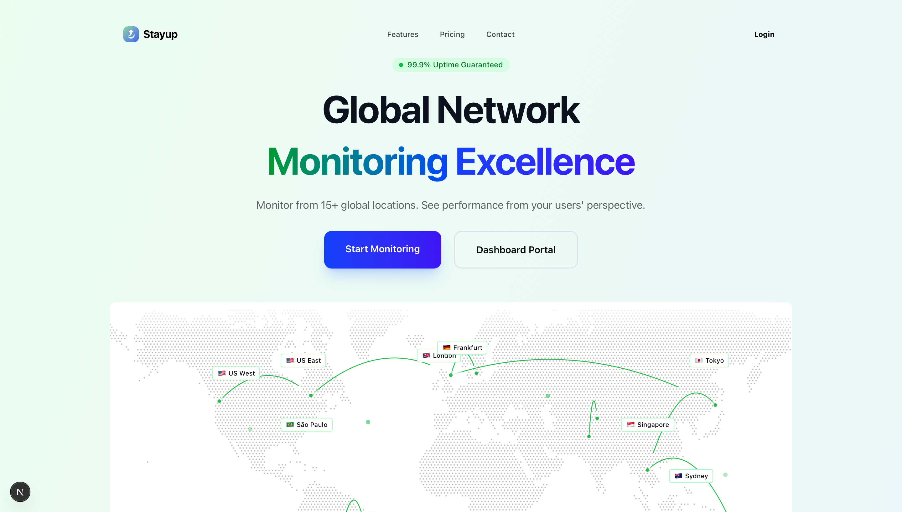

<p align="center">
  <picture>
    <source srcset="frontendui/public/stayup.png" media="(prefers-color-scheme: dark)">
    
  </picture>
</p>

# StayUp

An Open-Source Uptime Monitoring App



## What is StayUp?

StayUp is an open-source uptime monitoring solution that gives users the power to **self-host** their own uptime monitoring app while also integrating external services like email notifications and webhooks. Our goal is to modernize and improve uptime monitoring through intelligent alerting and comprehensive dashboard insights.

## Why StayUp?

Most uptime monitoring services today are either **closed-source**, **data-hungry**, or **too complex to self-host**.
StayUp is different:

-  **Open-Source**  No hidden agendas, fully transparent.
- **Intelligent Monitoring** - Advanced monitoring with customizable check intervals and alert configurations.
- **Data Privacy First**  Your monitoring data, your control. StayUp does not track, collect, or sell your data in any way. Please note: while we integrate with external services, the data passed through them is not under our control and falls under their respective privacy policies and terms of service.
- ™ **Self-Hosting Freedom**  Run your own uptime monitoring service with ease.
- **Multi-Channel Alerts**  Get notified via email, webhooks, and more when your services go down.
- **Customizable Dashboard**  Monitor all your services from a single, intuitive dashboard.
- **Developer-Friendly**  Built with extensibility and integrations in mind.

## Features

- **Website & Service Monitoring**: Monitor HTTP/HTTPS endpoints, APIs, and services with customizable check intervals.
- **Intelligent Alerting**: Configure smart alerts with escalation policies and notification preferences.
- **Multi-Channel Notifications**: Get notified via email, webhooks, Slack, and other channels when issues are detected.
- **Comprehensive Dashboard**: Get a real-time overview of all your monitored services with uptime statistics and response times.
- **Incident Management**: Track and manage incidents with detailed logs and resolution tracking.
- **Global Monitoring**: Monitor your services from multiple geographic locations for accurate uptime reporting.
- **API Integration**: Full REST API for programmatic access to monitoring data and configuration.

## Tech Stack

StayUp is built with modern and reliable technologies:

- **Frontend**: Next.js, React, TypeScript, TailwindCSS, Shadcn UI
- **Backend**: NestJS, Node.js, Drizzle ORM
- **Database**: PostgreSQL (Neon)
- **Authentication**: Better Auth
- **Monitoring Engine**: AWS Lambda functions with SQS queuing
- **Notifications**: Nodemailer, AWS SES
- **Testing**: Jest
- **Queue Management**: Bull/Redis

## Getting Started

### Prerequisites

**Required Versions:**

- [Node.js](https://nodejs.org/en/download) (v18 or higher)
- [npm](https://www.npmjs.com) or [pnpm](https://pnpm.io) (v10 or higher)
- [Docker](https://docs.docker.com/engine/install/) (v20 or higher)

Before running the application, you'll need to set up services and configure environment variables.

### Setup

1. **Clone and Install**

   ```bash
   # Clone the repository
   git clone <your-repo-url>
   cd stayup

   # Install dependencies for frontend
   cd frontendui
   npm install

   # Install dependencies for backend
   cd ../backend
   npm install

   # Install dependencies for lambda functions
   cd ../lambda
   npm install
   ```

2. **Set Up Environment**
   - Create `.env` files in both `frontendui/` and `backend/` directories from their respective `.env.example` files
   - Set up your PostgreSQL database (we recommend Neon for easy setup)
   - Configure authentication and notification services

3. **Start the Application**

   ```bash
   # Start the backend API
   cd backend
   npm run start:dev

   # In a new terminal, start the frontend
   cd frontendui
   npm run dev
   ```

4. **Open in Browser**

   Visit [http://localhost:3000](http://localhost:3000)

### Environment Setup

1. **Better Auth Setup**
   - Open the `frontendui/.env` file and change the BETTER_AUTH_SECRET to a random string. (Use `openssl rand -hex 32` to generate a 32 character string)

     ```env
     BETTER_AUTH_SECRET=your_secret_key
     ```

2. **Database Setup**
   - Set up a PostgreSQL database (we recommend [Neon](https://neon.tech) for easy cloud setup)
   - Add your database connection string to both frontend and backend `.env` files:

     ```env
     DATABASE_URL="your_postgresql_connection_string"
     ```

3. **Email Notifications Setup** (Optional)
   - Configure AWS SES or SMTP settings for email notifications
   - Add email configuration to `backend/.env`:

     ```env
     EMAIL_FROM=your-email@domain.com
     SMTP_HOST=your-smtp-host
     SMTP_PORT=587
     SMTP_USER=your-smtp-user
     SMTP_PASS=your-smtp-password
     ```

### Database Setup

StayUp uses PostgreSQL for storing monitoring data. Here's how to set it up:

1. **Database Connection**

   For cloud setup (recommended), use [Neon](https://neon.tech):
   - Create a new Neon project
   - Copy the connection string to your `.env` files

   For local development:
   ```bash
   # Start local PostgreSQL with Docker
   docker run --name stayup-postgres -e POSTGRES_PASSWORD=postgres -e POSTGRES_DB=stayup -p 5432:5432 -d postgres:15
   ```

2. **Database Commands**
   - **Set up database tables**:

     ```bash
     # In frontend directory
     npm run db:push
     
     # In backend directory
     npm run db:push
     ```

   - **Create migration files** (after schema changes):

     ```bash
     npm run db:generate
     ```

   - **Apply migrations**:

     ```bash
     npm run db:push
     ```

## AWS Lambda Setup (Optional)

StayUp uses AWS Lambda functions for distributed monitoring. To set up:

1. **Configure AWS Credentials**
   ```bash
   aws configure
   ```

2. **Deploy Lambda Functions**
   ```bash
   cd lambda
   npm run build
   # Follow AWS deployment instructions in lambda/README.md
   ```

3. **Configure SQS Queue**
   - Set up an SQS queue for monitoring job distribution
   - Add queue URL to backend environment variables

## Monitoring Configuration

### Adding Monitors

1. Navigate to the dashboard after signing in
2. Click "Add Monitor" to create a new monitoring target
3. Configure:
   - **URL**: The endpoint to monitor
   - **Check Interval**: How often to check (1-60 minutes)
   - **Timeout**: Request timeout duration
   - **Alert Recipients**: Who to notify on failures

### Alert Configuration

- **Email Alerts**: Configure SMTP settings in backend environment
- **Webhook Alerts**: Add webhook URLs for custom integrations
- **Escalation Policies**: Set up multi-tier alerting

## API Documentation

StayUp provides a comprehensive REST API for programmatic access:

- **Base URL**: `http://localhost:3001/api` (development)
- **Authentication**: JWT tokens via Better Auth
- **Documentation**: Available at `/api/docs` when running the backend

### Example API Usage

```javascript
// Get all monitors
fetch('/api/monitors', {
  headers: {
    'Authorization': 'Bearer your-jwt-token'
  }
})

// Create a new monitor
fetch('/api/monitors', {
  method: 'POST',
  headers: {
    'Content-Type': 'application/json',
    'Authorization': 'Bearer your-jwt-token'
  },
  body: JSON.stringify({
    name: 'My Website',
    url: 'https://example.com',
    interval: 5
  })
})
```

## Contribute

Please refer to the contributing guide.